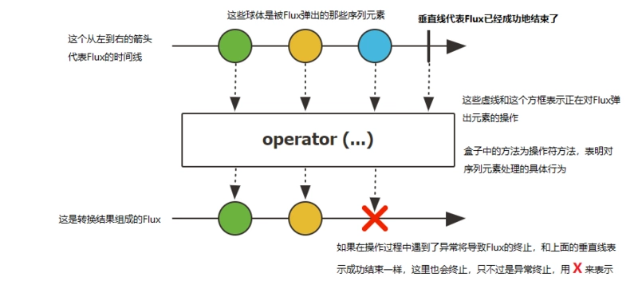

Flux 类似 RaxJava 的 Observable，它可以触发零到多个事件，并根据实际情况结束处理或触发错误。

`Flux` 是一个发出(emit) `0-N` 个元素组成的异步序列的 `Publisher<T>`,可以被 `onComplete` 信号或者 `onError` 信号所终止。在响应流规范中存在三种给下游消费者调用的方法  `onNext`,  `onComplete`, 和 `onError`。

下图表示了Flux的抽象模型：

~

### 参考资料

- [Java反应式框架Reactor中的Mono和Flux](https://segmentfault.com/a/1190000024499748)