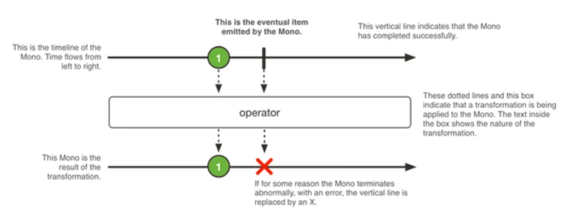

Mono 最多只触发一个事件，它跟 RxJava 的[ Single ](http://reactivex.io/documentation/single.html)和[ Maybe ](http://reactivex.io/RxJava/2.x/javadoc/io/reactivex/Maybe.html)类似，所以可以把 Mono用于在异步任务完成时发出通知。

`Mono` 是一个发出(emit)`0-1`个元素的`Publisher<T>`,可以被`onComplete`信号或者`onError`信号所终止。

### 参考资料

- [Java反应式框架Reactor中的Mono和Flux](https://segmentfault.com/a/1190000024499748)