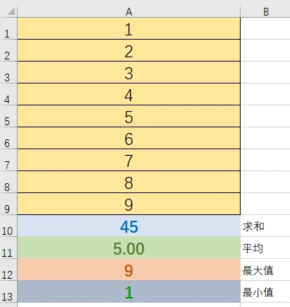

由于响应流的特点，我们不能再返回一个简单的**POJO**对象来表示结果了。必须返回一个类似**Java**中的`Future`的概念，在有结果可用时通知消费者进行消费响应。

**Reactive Stream**规范中这种被定义为`Publisher<T>` ，`Publisher<T>`是一个可以提供0-N个序列元素的提供者，并根据其订阅者`Subscriber<? super T>`的需求推送元素。一个`Publisher<T>`可以支持多个订阅者，并可以根据订阅者的逻辑进行推送序列元素。下面这个**Excel**计算就能说明一些`Publisher<T>`的特点。

**A1-A9**就可以看做`Publisher<T>`及其提供的元素序列。**A10-A13**分别是求和函数`SUM(A1:A9)`、平均函数`AVERAGE(A1:A9)`、最大值函数`MAX(A1:A9)`、最小值函数`MIN(A1:A9)`，可以看作订阅者`Subscriber`。假如说我们没有**A10-A13**，那么**A1-A9**就没有实际意义，它们并不产生计算。这也是响应式的一个重要特点：**当没有订阅时发布者什么也不做**。

而`Flux`和`Mono`都是`Publisher<T>`在**Reactor 3**实现。`Publisher<T>`提供了`subscribe`方法，允许消费者在有结果可用时进行消费。如果没有消费者`Publisher<T>`不会做任何事情，他根据消费情况进行响应。 `Publisher<T>`可能返回零或者多个，甚至可能是无限的，为了更加清晰表示期待的结果就引入了两个实现模型`Mono`和`Flux`。

### 参考资料

- [Java反应式框架Reactor中的Mono和Flux](https://segmentfault.com/a/1190000024499748)