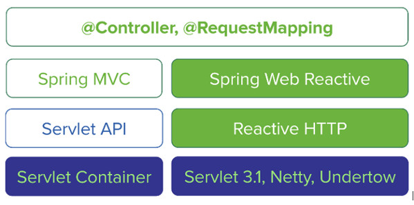

{}
静态网站生成器，专注内容，快速创作。
{}

## 背景：响应式编程

响应式编程（Reactive Programming）是一种新的编程范式，中文称响应式（或反应式）编程，是一种高性能应用的编程方式。其最早是由微软提出并引入到 .NET 平台中，随后 ES6 也引入了类似的技术。在 Java 平台上，较早采用反应式编程技术的是 Netflix 公司开源的 RxJava 框架。现在大家比较熟知的 Hystrix 就是以 RxJava 为基础开发的。

响应式编程来源于数据流和变化的传播，意味着由底层的执行模型负责通过数据流来自动传播变化。

比如求值一个简单的表达式 c=a+b，当 a 或者 b 的值发生变化时，传统的编程范式需要对 a+b 进行重新计算来得到 c 的值。如果使用反应式编程，当 a 或者 b 的值发生变化时，c 的值会自动更新。

在传统的编程范式中，我们一般通过迭代器（Iterator）模式来遍历一个序列。这种遍历方式是由调用者来控制节奏的，采用的是拉的方式。每次由调用者通过 next()方法来获取序列中的下一个值。使用反应式流时采用的则是推的方式，即常见的发布者-订阅者模式。当发布者有新的数据产生时，这些数据会被推送到订阅者来进行处理。在反应式流上可以添加各种不同的操作来对数据进行处理，形成数据处理链。这个以声明式的方式添加的处理链只在订阅者进行订阅操作时才会真正执行。

### 响应式编程的基础

响应式编程的基础：

- 数据流的概念
- Observable 类和它的各种操作
- 通过工厂方法创建静态和动态的Observable 对象

Observable 是事件的源头，Observer 提供了一组简单的接口，并通过订阅事件源来消费 Observable 的事件。Observable 通过 onNext 向 Observer 通知事件的到达，后面可能会跟上 onError 或 onComplete 来表示事件的结束。

反应式编程其实并不神秘，通过与我们熟悉的迭代器模式对比便可了解其基本思想：

| event          | Iterable (pull)    | Observable (push)    |
| -------------- | ------------------ | -------------------- |
| retrieve data  | `T next()`         | `onNext(T)`          |
| discover error | throws `Exception` | `onError(Exception)` |
| complete       | `!hasNext()`       | `onCompleted()`      |

上面表格的中的 Observable 那一列便代表反应式编程的 API 使用方式。可见，它就是常见的观察者模式的一种延伸。如果将迭代器看作是拉模式，那观测者模式便是推模式。被订阅者（Publisher）主动的推送数据给订阅者（Subscriber），触发 `onNext` 方法。异常和完成时触发另外两个方法。

### 回压（Backpressure）

反应式流中第一个重要概念是回压（backpressure）。在基本的消息推送模式中，当消息发布者产生数据的速度过快时，会使得消息订阅者的处理速度无法跟上产生的速度，从而给订阅者造成很大的压力。当压力过大时，有可能造成订阅者本身的奔溃，所产生的级联效应甚至可能造成整个系统的瘫痪。负压的作用在于提供一种从订阅者到生产者的反馈渠道。订阅者可以通过 request()方法来声明其一次所能处理的消息数量，而生产者就只会产生相应数量的消息，直到下一次 request()方法调用。这实际上变成了推拉结合的模式。

背压是反应流中的一个重要概念，可以理解为，生产者可以感受到消费者反馈的消费压力，并根据压力进行动态调整生产速率。形象点可以按照下面理解：

**回压**是 RS 规范和 Reactor 主要关注点之一（如果还有其它关注点的话）。回压的原理是说，在一个推送场景里，生产者的生产速度比消费者的消费速度快，消费者会向生产者发出信号说“嘿，慢一点，我处理不过来了。”生产者可以借机控制数据生成的速度，而不是抛弃数据或者冒着产生级联错误的风险继续生成数据。

你也许会想，在 Mono 里为什么也需要回压：什么样的消费者会被一个单独的触发事件压垮？答案是“应该不会有这样的消费者”。不过，在 Mono 和 CompletableFuture 工作原理之间仍然有一个关键的不同点。后者只有推送：如果你持有一个 Future 的引用，那么说明一个异步任务已经在执行了。另一方面，回压的 Flux 或 Mono 会启动延迟的拉取 - 推送迭代：

1. 延迟是因为在调用 subscribe() 方法之前不会发生任何事情
2. 拉取是因为在订阅和发出请求时，Subscriber 会向上游发出信号，准备拉取下一个数据块
3. 接下来生产者向消费者推送数据，这些数据在消费者的请求范围之内

对 Mono 来说，subscribe() 方法就相当于一个按钮，按下它就等于说“我准备好接收数据了”。Flux 也有一个类似的按钮，不过它是 request(n) 方法，这个方法是 subscribe() 的一般化用法。

Mono 作为一个 Publisher，它往往代表着一个耗费资源的任务（在 IO、延迟等方面），意识到这点是理解回压的关键：如果不对其进行订阅，你就不需要为之付出任何代价。因为 Mono 经常跟具有回压的 Flux 一起被编排到一个响应式链上，来自多个异步数据源的结果有可能被组合到一起，这种按需触发的能力是避免阻塞的关键。

我们可以使用回压来区分 Mono 的不同使用场景，相比上述的例子，Mono 有另外一个常见的使用场景：把 Flux 的数据异步地聚合到 Mono 里。reduce 和 hasElement 可以消费 Flux 里的每一个元素，再把这些数据以某种形式聚合起来（分别是 reduce 函数的调用结果和一个 boolean 值），作为一个 Mono 对外暴露数据。在这种情况下，使用 Long.MAX_VALUE 向上游发出回压信号，上游会以完全推送的方式工作。

关于回压另一个有意思的话题是它如何对存储在内存里的流的对象数量进行限制。作为一个 Publisher，数据源很有可能出现生成数据缓慢的问题，而来自下游的请求超出了可用数据项。在这种情况下，整个流很自然地进入到推送模式，消费者会在有新数据到达时收到通知。当生产高峰来临，或者在生产速度加快的情况下，整个流又回到了拉取模式。在以上两种情况下，最多有 N 项数据（request() 请求的数据量）会被保留在内存里。

你可以对内存的使用情况进行更精确的推算，把 N 项数据跟每项数据需要消耗的内存 W 结合起来：这样你就可以推算出最多需要消耗 W*N 的内存。实际上，Reactor 在大多数情况下会根据 N 来做出优化：根据情况创建内部队列，并应用预取策略，每次自动请求 75% 的数据量。

Reactor 的操作有时候会根据它们所代表的语义和调用者的期望来改变回压信号。例如对于操作 buffer(10)：下游请求 N 项数据，而这个操作会向上游请求 10N 的数据量，这样就可以填满缓冲区，为订阅者提供足够的数据。这通常被称为“主动式回压”，开发人员可以充分利用这种特性，例如在微批次场景里，可以显式地告诉 Reactor 该如何从一个输入源切换到一个输出地。

### Imperative vs Reactive

对于 Iterable 和 Observale 两种风格，还有另一个称呼，便是 Imperative（指令式编程）和 Reactive（反应式编程）这两种风格。其实就是拉模型和推模型的另一种表述。

对于 Imperative，老外写的文章有时会用，直译就是指令式编程，其实就是我们大家平时用 Java、Python 等语言写代码的常见风格，代码执行顺序和编写顺序基本一致（这里不考虑 JVM 指令重排）

## 发展历程

### Reactive Extensions (Rx) 库

反应式编程最早由 .NET 平台上的 Reactive Extensions (Rx) 库来实现。

后来迁移到 Java 平台之后就产生了著名的 RxJava 库，并产生了很多其他编程语言上的对应实现。在这些实现的基础上产生了后来的反应式流（Reactive Streams）规范。

### RxJava

RxJava 库是 JVM 上反应式编程的先驱，也是反应式流规范的基础。

不过 RxJava 库也有其不足的地方。RxJava 产生于反应式流规范之前，虽然可以和反应式流的接口进行转换，但是由于底层实现的原因，使用起来并不是很直观。

在 RxJava 1 里，只有少部分操作支持回压，RxJava 1 的 Observable 并没有实现 RS 里的任何类型，不过它有一些 RS 类型的适配器。可以说，RxJava 1 实际上比 RS 规范出现得更早，而且在 RS 规范设计期间，RxJava 1 充当了函数式工作者的角色。

正如“RxJava 实例解析”里所说的，从设计概念方面来看，RxJava 有点类似 Java 8 Steams API。

### Reactive Streams 规范

在 Java 平台上，Netflix（开发了 RxJava）、TypeSafe（开发了 Scala、Akka）、Pivatol（开发了 Spring、Reactor）共同制定了一个被称为 [Reactive Streams 项目（规范）](https://links.jianshu.com/go?to=https%3A%2F%2Fgithub.com%2Freactive-streams%2Freactive-streams-jvm)，用于制定反应式编程相关的规范以及接口。其主要的接口有这三个：

- `Publisher`
- `Subscriber`
- `Subcription`

其中，`Subcriber` 中包含 `onNext`、`onError`、`onCompleted` 这三个方法。

该规范定义了反应式流的相关接口，并将集成到 Java 9 中。

[Reactive Streams ](http://www.reactive-streams.org/)（简称为 RS）是“一种规范，它为基于非阻塞回压的异步流处理提供了标准”。它是一组包含了 TCK 工具套件和四个简单接口（Publisher、Subscriber、Subscription 和 Processor）的规范，这些接口将被集成到 Java 9.

RS 主要跟响应式回压（稍后会详细介绍）以及多个响应式事件源之间的交互操作有关。它并不提供任何操作方法，它只关注流的生命周期。

### RxJava 2

RxJava 2 在 RxJava 的基础上做了很多的更新。

RxJava 2 在设计和实现时考虑到了与规范的整合，不过为了保持与 RxJava 的兼容性，很多地方在使用时也并不直观。

RxJava 2 是在 RS 规范之后出现的，所以它直接在 Flowable 类型里实现了 Publisher。不过除了 RS 类型，RxJava 2 还保留了 RxJava 1 的“遗留”类型（Observable、Completable 和 Single）并且引入了其它一些可选类型——Maybe。这些类型提供了不同的语义，不过它们并没有实现 RS 接口，这是它们的不足之处。

跟 RxJava 1 不一样，RxJava 2 的 Observable 不支持 RxJava 2 的回压协议（只有 Flowable 具备这个特性）。之所以这样设计是为了能够为一些场景提供一组丰富且流畅的 API，比如用户界面发出的事件，在这样的场景里是不需要用到回压的，而且也不可能用到。Completable、Single 和 Maybe 不需要支持回压，不过它们也提供了一组丰富的 API，而且在被订阅之前不会做任何事情。

### Reactor

Reactor 则是完全基于反应式流规范设计和实现的库，没有 RxJava 那样的历史包袱，在使用上更加的直观易懂。

Reactor 是[第四代](http://akarnokd.blogspot.fr/2016/03/operator-fusion-part-1.html)响应式框架，跟RxJava 2 有些相似。Reactor 项目由Pivotal 启动，以响应式流规范、Java8 和ReactiveX 术语表为基础。它的设计是Reactor 2（上一个主要版本）和RxJava 核心贡献者共同努力的结果。

Reactor 不同于其它框架的最关键一点就是 RS。Flux 和 Mono 这两者都是 RS 的 Publisher 实现，它们都具备了响应式回压的特点。Mono 最多只触发一个事件，它跟 RxJava 的[ Single ](http://reactivex.io/documentation/single.html)和[ Maybe ](http://reactivex.io/RxJava/2.x/javadoc/io/reactivex/Maybe.html)类似，所以可以把 Mono用于在异步任务完成时发出通知。

因为这两种类型之间的简单区别，我们可以很容易地区分响应式 API 的类型：从返回的类型我们就可以知道一个方法会“发射并忘记”或“请求并等待”（Mono），还是在处理一个包含多个数据项的流（Flux）。

Flux 和 Mono 的一些操作利用了这个特点在这两种类型间互相转换。例如，调用 Flux的 single() 方法将返回一个 Mono，而使用 concatWith() 方法把两个 Mono 串在一起就可以得到一个 Flux。类似地，有些操作对 Mono 来说毫无意义（例如 take(n) 会得到 n>1 的结果），而有些操作只有作用在 Mono 上才有意义（例如 or(otherMono)）。

Reactor 设计的原则之一是要保持 API 的精简，而对这两种响应式类型的分离，是表现力与 API 易用性之间的折中。

“使用响应式流，基于 Rx 构建”

正如“RxJava 实例解析”里所说的，从设计概念方面来看，RxJava 有点类似 Java 8 Steams API。而 Reactor 看起来有点像 RxJava，不过这决不只是个巧合。这样的设计是为了能够给复杂的异步逻辑提供一套原生的具有 Rx 操作风格的响应式流 API。所以说 Reactor 扎根于响应式流，同时在 API 方面尽可能地与 RxJava 靠拢。

在响应式领域，Reactor 变得愈加精益，它的 Mono 和 Flux 两种类型都实现了 Publisher，并且都支持回压。虽然把 Mono 作为一个 Publisher 需要付出一些额外的开销，不过 Mono 在其它方面的优势弥补了它的缺点。在后续部分我们将看到对 Mono 来说回压意味着什么。

### Spring5

Reactor 也是 Spring 5 中反应式编程的基础。学习和掌握 Reactor 可以更好地理解 Spring 5 中的相关概念。

Reactor 是 Spring 整个生态系统的基础，特别是 Spring 5（通过 Spring Web Reactive）和 Spring Data “kay”（跟 spring-data-commons 2.0 相对应的）。

这两个项目的响应式版本是非常有用的，我们因此可以开发出完全响应式的 Web 应用：异步地处理请求，一直到数据库，最后异步地返回结果。Spring 应用因此可以更有效地利用资源，避免为每个请求单独分配一个线程，还要等待 I/O 阻塞。

Reactor 将被用于未来 Spring 应用的内部响应式核心组件，以及这些 Spring 组件暴露出来的 API。一般情况下，它们可以处理 RS Publisher，不过大多数时候它们要面对的是 Flux/Mono，需要用到 Reactor 的丰富特性。当然，你也可以自行选择其它响应式框架，Reactor 提供了可以用来适配其它 Reactor 类型和 RxJava 类型甚至简单的 RS 类型的钩子接口。

另外，虽然 Spring API 是以 Reactor 类型为基础的，不过在 Spring Web Reactive 模块里可以为请求和响应使用各种各样的响应式类型：

- Mono：作为 @RequestBody，请求实体 T 会被异步反序列化，之后的处理可以跟 Mono 关联起来。作为返回类型，每次 Mono 发出了一个值，T 就会被异步序列化并发回客户端。你可以把请求 Mono 作为参数，并把参数化了的关联处理作为结果 Mono 返回。
- Flux：在流场景里使用（作为 @RequestBody 使用的输入流以及包含了 Flux 返回类型的 Server Sent Events）。
- Single/Observable：分别对应 Mono 和 Flux，不过会切换回 RxJava。
- Mono 作为返回类型：在 Mono 结束时请求的处理也跟着完成。
- 非响应式返回类型（void 和 T）：这个时候你的 @Controller 方法是同步的，不过它应该是非阻塞的（短暂的处理）。请求处理在方法执行完毕时结束，返回的 T 被异步地序列化并发回客户端。

## 参考资料

- [Reactor 实例解析](https://www.infoq.cn/article/reactor-by-example)
- [Spring Reactor 入门与实践](https://www.jianshu.com/p/7ee89f70dfe5)