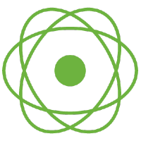

{}
静态网站生成器，专注内容，快速创作。
{}

## Reactor是什么？

Reactor 是完全基于反应式流规范设计和实现的库，是 Spring 5 中反应式编程的基础。

**Reactive Streams based projects for backpressure-ready asynchronous message passing.**

### 响应式编程

- [Reactive programming 一种技术 各自表述](https://mercyblitz.github.io/2018/07/25/Reactive-Programming-%E4%B8%80%E7%A7%8D%E6%8A%80%E6%9C%AF-%E5%90%84%E8%87%AA%E8%A1%A8%E8%BF%B0/)

 

## 

